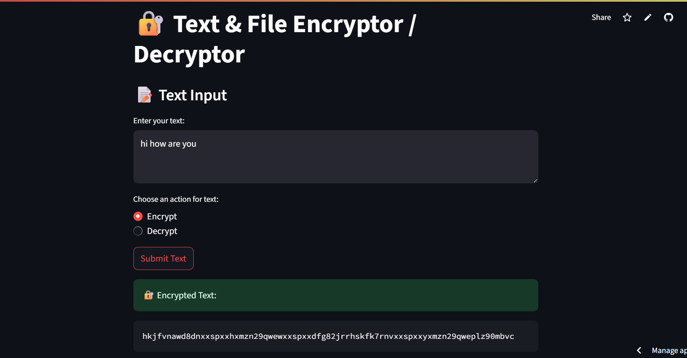
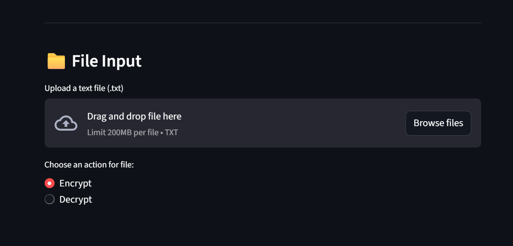
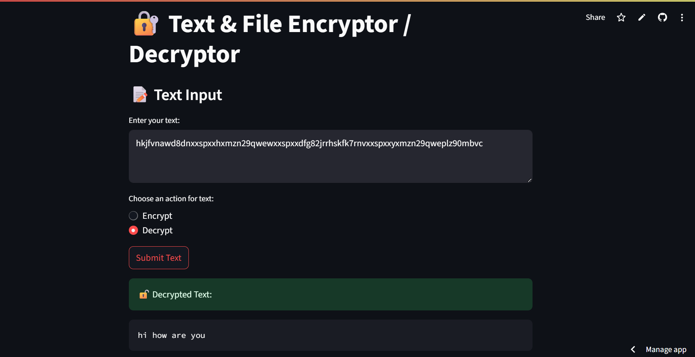

# 🔐 Text & File Encryptor/Decryptor

A simple and educative **Streamlit web app** to encrypt and decrypt plain text or `.txt` files using custom substitution logic. This project is designed for learning, showcasing Streamlit apps, and demonstrating basic encryption concepts — no database or backend required!

---

## 🚀 Features

- 🔤 Encrypt and decrypt plain text input
- 📁 Upload `.txt` files to encrypt or decrypt contents
- 📥 Download processed text or files
- 🔄 Instant result preview
- 🧠 Custom, symbolic encryption (educational purpose)
- 💡 Beginner-friendly code and UI

---

## 🧠 How It Works

This app uses **basic character substitution** to mimic how encryption works. For example:

| Character | Encrypted As      |
|-----------|-------------------|
| `a`       | `dfg82jr`         |
| `e`       | `hskfk7rnv`       |
| `i`       | `kjfvnawd8dn`     |
| `o`       | `xmzn29qwe`       |
| `u`       | `plz90mbvc`       |
| `space`   | `xxspxx`          |

> ⚠️ Note: This is not a secure encryption method and is intended for educational/demonstration purposes only.

---

## 🖼️ App Interface

<p align="center">
  
</p>
<p align="center">
  
</p>
<p align="center">
  
</p>


## 🛠️ How to Run This Project Locally

### 🔧 Requirements:
- Python 3.7 or higher
- pip

### 📦 Step-by-Step Instructions:

1. **Clone the repository**
```bash
git clone https://github.com/yourusername/text-encryptor-app.git
cd text-encryptor-app


